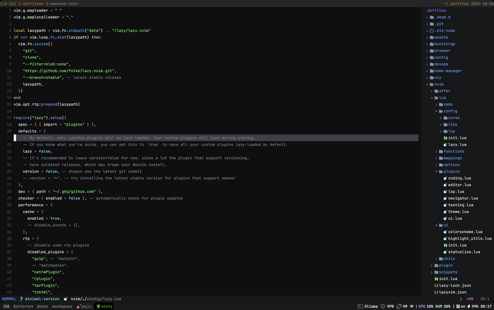

A basic set of dotfiles to enhance my daily development workflow 🧑‍🎨

## Flow with Terminal & Shell

I mostly using neovim as a main text editor. You can check the setup [here](./nvim)

Most people use zsh as their `shell`, but I prefer `fish` because it is simpler and easier to configure.
I also love the syntax of fish. To see more my configure [here](./terminals/fish)

My main terminal is [kitty](./terminals/kitty)

When handling multiple terminal at the same time I prefer using [Tmux](./terminals/tmux)

## My Screen Daily



## Flow with Window Management

I use [yabai](./suckless/mac_os/yabai) as the main window management system and also set up a decorator menubar UI using [Sketchy Bar](./suckless/mac_os/sketchybar)

In addition, I have configured keybindings to improve my speed and control over Windows or applications.

Two main key binding tools are below:
- [Skhd](./suckless/mac_os/skhdrc)
- [Karabiner](./suckless/mac_os/karabiner)

## How I set up that?

Basically, I save all instructions for installing tools and plugins in the shell file below.
Simply run it, and it will be set up for you.

```bash
# For MacOS
./bootstrap/mac.sh

# For Arch Linux
./bootstrap/arch.sh
```

## New Flow With Nix
Installing nix package manager following the documentation [here](https://nixos.org/download.html)

```bash
ln -s ~/.dotfiles/nix ~/.config/nix # Create Symlink with nix config
ln -s ~/.dotfiles/home-manager ~/.config/home-manager # Create Symlink with home-manager config

nix-shell -p home-manager # Run new shell with home-manager package

home-manager switch # Apply the configuration
```
