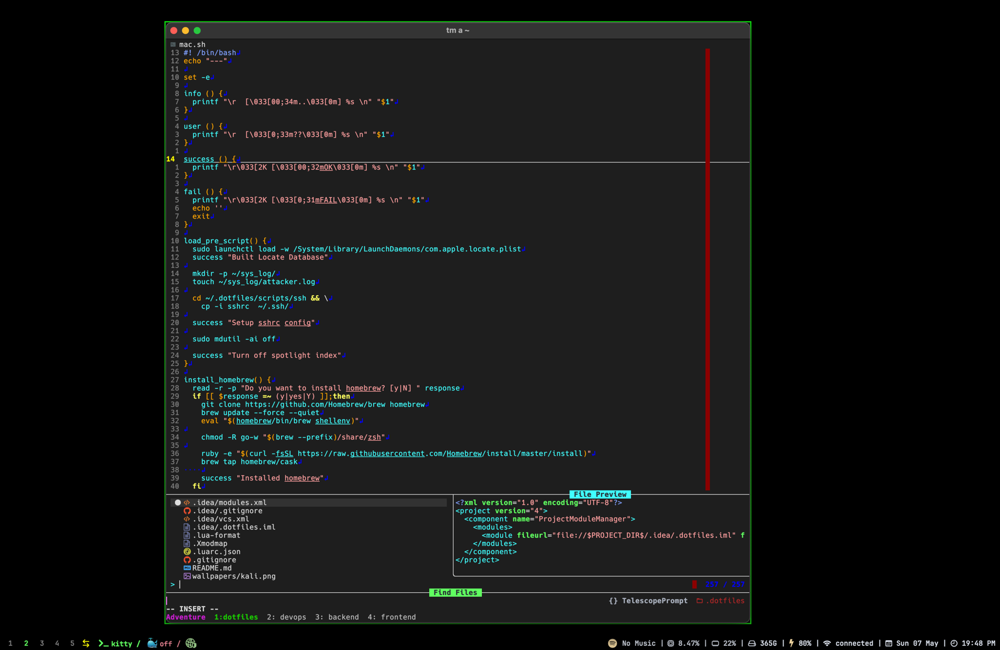

# I. Introduction

This is my dotfiles that contains scripts for setting up fish shell, neovim and other tools that boost my productivity day



# II.Structure

### Terminal
- Editor 
  - [Nvim](./nvim)
  - [Doom Emacs](./terminals/emacs)
- Shell: [Fish](./terminals/fish)
- Terminal: [KiTTY](./terminals/kitty)
- Tmux: [Tmux](./terminals/tmux)
- Tmux Manage Project: [Tmuxinator](./terminals/tmuxinator)

### WM
- [Yabai](./suckless/mac_os/yabai)

### Keybindings
- [Skhd](./suckless/mac_os/skhdrc)
- [Karabiner](./suckless/mac_os/karabiner)

### UI
- Wallpaper: [Wallpaper](./wallpapers)
- Bar: [Sketchy Bar](./suckless/mac_os/sketchybar)

### Browser
- [Firefox](./browsers/firefox)
- [Qutebrowser](./suckless/qutebrowser)

# III.Installing
> For MacOS
```bash
./bootstrap/mac.sh
```
---

> For Linux
```bash
./bootstrap/linux.sh
```
---

> For Arch Linux
```bash
./bootstrap/arch.sh
```