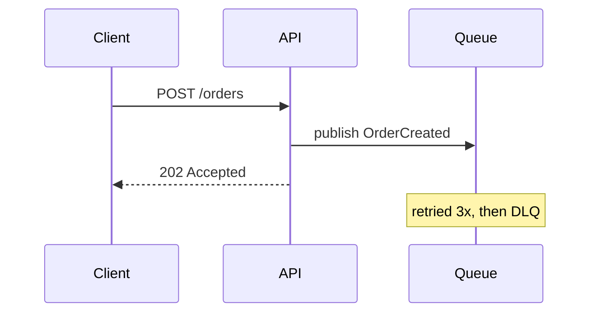
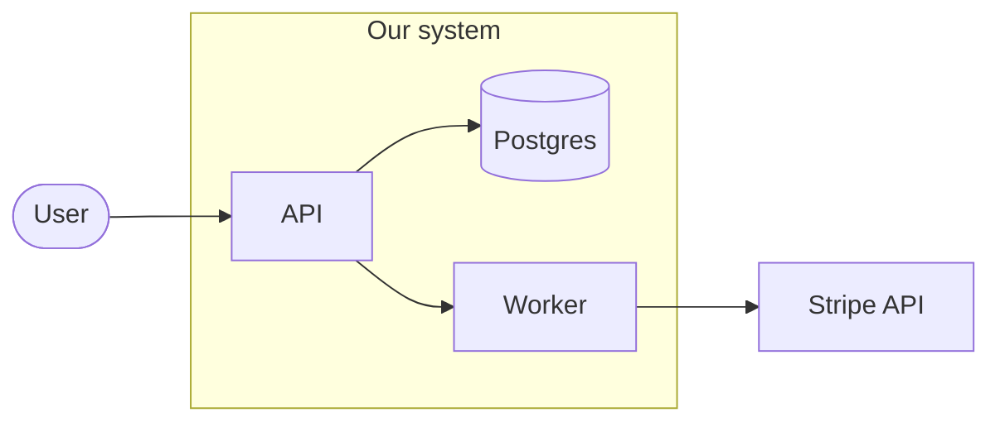
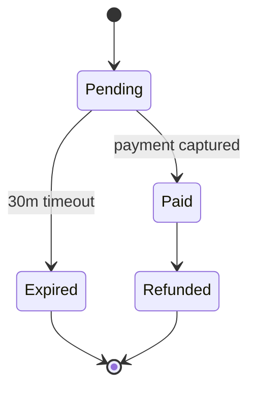
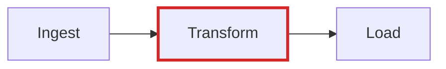

# Templates

Skeletons, not forms. Delete any heading that has nothing to say — an empty section costs the reader more than a missing one.

## Design doc / RFC

```markdown
# <What this proposes, as a statement>

**Status:** draft | in review | accepted | rejected
**Author:** · **Reviewers:** · **Date:**

## Summary
Two sentences: the problem, and what you propose. A reader who stops here should
be able to repeat your position correctly.

## Problem
What breaks today, for whom, how often. Evidence — numbers, incidents, tickets.
No solutions in this section.

## Goals / Non-goals
Bullets. Non-goals are what makes review converge.

## Proposal
The design. Lead with a diagram if the shape is structural.
Cover the failure modes, not only the happy path.

## Alternatives considered
One short block per option: what it is, why not. "Do nothing" belongs here.

## Trade-offs
What this makes worse. If nothing gets worse, the analysis is not finished.

## Rollout
Migration, backward compatibility, feature flag, rollback, monitoring.

## Open questions
The decisions you want from reviewers, phrased as questions.
```

## ADR

Immutable once accepted. Supersede with a new ADR rather than editing.

```markdown
# ADR-0007: <decision, in the imperative>

**Status:** proposed | accepted | superseded by ADR-0012
**Date:**

## Context
The forces at play: constraints, requirements, what we know and don't.

## Decision
What we will do. One paragraph, present tense.

## Consequences
What becomes easier, what becomes harder, what we now have to live with.
```

## README

The first screen answers: what is this, is it for me, how do I run it.

```markdown
# Project

One sentence: what it does and who it is for.

## Quickstart
Copy-pasteable commands, in order, that produce a visible result.

## How it works
The mental model in a paragraph, plus a context diagram if it has moving parts.

## Configuration
Table: name · default · what it changes.

## Troubleshooting
Symptom → cause → fix.
```

## Runbook

Written for someone paged at 3am with no context. Imperative steps only.

```markdown
# Alert: <exact alert name>

**Impact:** who notices, and how. **Severity:**

## Verify
The command or dashboard that confirms this is real, and what a healthy result looks like.

## Mitigate
1. Numbered steps, one action each, safest first.
2. Note anything irreversible before the step that does it.

## Escalate
Who, and the condition that triggers escalation.

## Root cause
Where to look once the bleeding stops.
```

## Postmortem

Blameless: describe systems and decisions, never people.

```markdown
# <Incident>, <date>

**Impact:** duration, users affected, what they experienced.

## Timeline
Table: time (UTC) · event · how we knew.

## Root cause
The chain, ending at why the system allowed it.

## What went well / what didn't

## Action items
Table: action · owner · ticket. Each one prevents or shortens a recurrence.
```

## Mermaid starters

Sequence — who calls what, in what order:



Context — what is inside the boundary:



State — lifecycle and its terminal states:



Highlight the one thing the reader should look at, rather than explaining it in prose:


