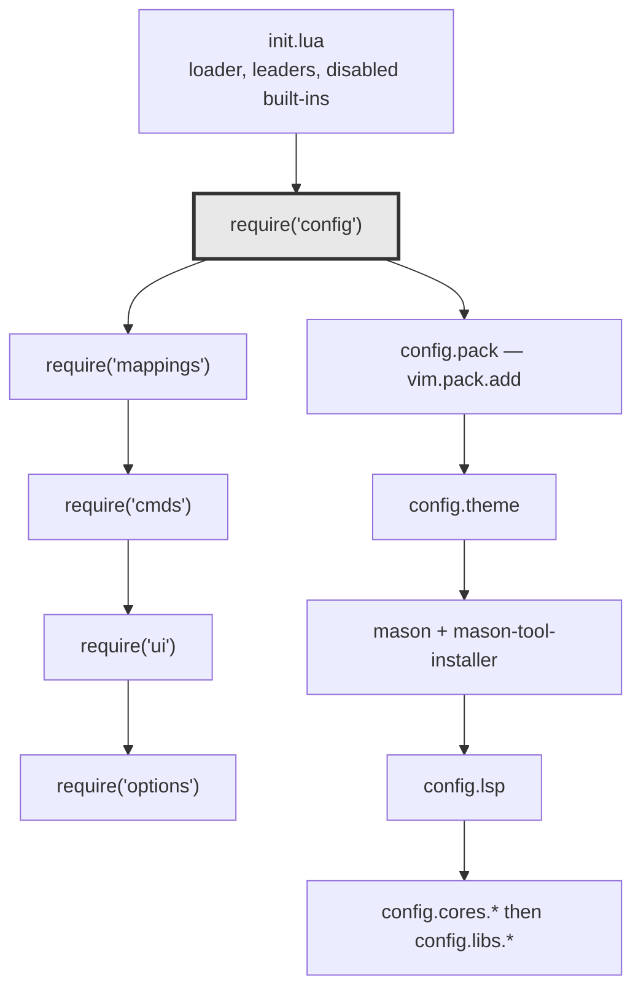
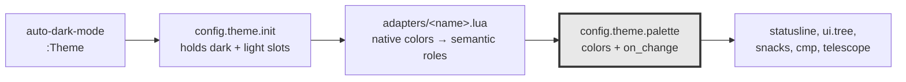

# Neovim Config Structure

Where to put a change in `nvim/`. Read the "Where do I add…" table first; the rest explains why the layout is shaped that way.

Neovim 0.12+, no plugin manager — plugins install through the built-in `vim.pack`. Keybindings live in [key-bindings-nvim.md](key-bindings-nvim.md); this doc covers layout only.

`~/.config/nvim` is a stow symlink to `nvim/` (`bootstrap/mac.sh:370`), so edits take effect on the next launch.

## Where do I add…

| Change | File |
|---|---|
| A new plugin | `lua/config/pack.lua` (the URL list), then a setup file under `lua/config/cores/` or `lua/config/libs/` and a `require` in `lua/config/init.lua` |
| A plugin's settings | `lua/config/cores/<plugin>.lua` (big, central plugins) or `lua/config/libs/<plugin>.lua` (small ones) |
| A language server | `lua/config/lsp/servers/<lang>.lua`, then a `require` in `lua/config/lsp/register_server.lua` |
| A formatter | `lua/config/lsp/register_formatters.lua` (conform.nvim) |
| A linter | `lua/config/lsp/lint.lua` (`linters_by_ft`) |
| An LSP/formatter/linter binary to auto-install | `lua/config/lsp/mason_packages.lua` |
| A keybinding | `lua/mappings/<domain>/<topic>.lua`, then a `require` in that domain's `init.lua` |
| A vim option | `lua/options/init.lua` |
| An autocommand | `lua/cmds/<name>.lua`, then a `require` in `lua/cmds/init.lua` |
| A colorscheme | `lua/config/theme/adapters/<name>.lua` + one entry in `adapter_loaders` in `lua/config/theme/init.lua` |
| A snippet | `snippets/*.json` (VSCode format, loaded by LuaSnip) |
| Something that should load with no `require` | `plugin/` — Neovim sources this directory itself, after `init.lua` |

## Load order

`init.lua` is deliberately thin: it sets what must exist before anything else (the Lua bytecode loader, disabled built-ins, leader keys), then calls five subsystems in a fixed order.



*Only `config` has internal ordering constraints; the other four are independent.*

Ordering that matters, and breaks if changed:

- Leader keys are set before plugins, because plugins read `vim.g.mapleader` at setup time.
- `config.pack` runs first — nothing can be `require`d before its plugin is on the runtimepath.
- `config.theme` runs before other UI plugins so they derive highlights from live colors.
- `mason` runs before `config.lsp`, since servers resolve to Mason-installed binaries.
- `config.cores.snipai` runs before `config.cores.cmp`: snipai registers a cmp source, and cmp reads its source list once at setup.
- Tool installation is deferred to a one-shot `VimEnter` autocmd, otherwise Mason blocks startup with a "press ENTER" prompt.

## Directory map

```
nvim/
  init.lua              bootstrap: loader, leaders, 5 requires
  plugin/               auto-sourced by nvim after init.lua, no require needed
  snippets/             VSCode-format snippets for LuaSnip
  .stylua.toml          formatting rules for this config
  lua/
    config/             plugin installation and setup
      pack.lua          the vim.pack plugin manifest + :PackClean
      theme/            colorscheme abstraction (see below)
      lsp/              servers, formatters, linters, diagnostics
      cores/            central plugins: telescope, cmp, treesitter, dap, git, snacks, tree, test
      libs/             smaller plugins: outline, marlin, metals, spectre, multicursor, editor (grab bag)
    mappings/           keybindings, grouped by domain
      editor/           buffers, telescope, test, dap, tree, general, …
      source_control/   gitsigns, neogit, diffview, conflict
      languages/        filetype-specific
      devops/           network helpers
      utils/            folds, quickfix, search, operator-pending
    cmds/               autocommands: term, vim_enter, python path, rails migration
    ui/                 hand-rolled statusline + nvim-tree highlights
    options/            vim options, incl. Neovide GUI settings
    utils/              generic Lua helpers
    functions/          small user-facing functions
```

Every directory follows the same convention: `init.lua` is a barrel that only `require`s its siblings, and each sibling owns one concern. Commenting out one line in a barrel disables that piece — `register_server.lua` and `mappings/editor/init.lua` both use this to park unused config.

## Theme abstraction

The one non-obvious piece. Six colorschemes are installed, and dark/light flips automatically with macOS appearance, so nothing that needs a color may reference a colorscheme directly.



*Consumers subscribe to the palette, so they never learn which colorscheme is active.*

- **`init.lua`** keeps two slots (dark, light) and applies one. Adapters load lazily; the chosen pair persists to `stdpath('state')/theme.json` and survives restarts. `:Theme` prints the state, `:Theme cendre` sets both, `:Theme dark=cendre light=github` sets each.
- **`adapters/<name>.lua`** translates a colorscheme's native palette into semantic roles (`bg`, `bg_alt`, `text`, `muted`, …) and applies it.
- **`palette.lua`** exposes `M.colors` plus `M.on_change(fn)`. A `ColorScheme` autocmd rebuilds the roles and notifies subscribers.

`apply()` suppresses `ColorScheme` for the whole swap and fires exactly one event after the new theme is live. Without this, plugins that set highlights with `default = true` latch onto the outgoing theme's colors during the `background` flip and stay one toggle behind until restart — the comment at `lua/config/theme/init.lua:117` has the full story.

## Dead files

Four modules are on disk but nothing requires them; treat them as removable, not as reference:

- `lua/config/libs/todo.lua` — todo-comments is configured in `lua/mappings/editor/todocomment.lua` instead
- `lua/config/libs/git_utils.lua`
- `lua/utils/merge.lua`
- `lua/functions/git_blame_toggle.lua`
- `plugin/gotowindow.vim` — calls `MaximizerToggle`, and vim-maximizer is not installed

## Manual steps after a fresh install

`vim.pack` clones repos but runs no build hooks, so three plugins need one command each. `pack.lua` carries these as comments at the relevant lines:

1. Install parsers: `:lua require('nvim-treesitter').install({})`
2. Build the fzf sorter: `make` inside the `telescope-fzf-native.nvim` pack directory
3. Remove plugins dropped from the list: `:PackClean`
